<div align="center">

# 🧘 MindEase

### AI-Powered Mental Wellness Voice Companion

[](https://www.python.org/)
[](https://streamlit.io/)
[](https://ai.google.dev/)
[](https://sdgs.un.org/goals/goal3)

**IBM SkillsBuild Applied AI Internship 2025 | Capstone Project**

[Features](#-features) • [Demo](#-demo) • [Installation](#-installation) • [Usage](#-usage) • [Documentation](#-documentation)

</div>

---

## 📋 Table of Contents

- [Overview](#-overview)
- [Features](#-features)
- [Demo](#-demo)
- [Architecture](#-architecture)
- [Installation](#-installation)
- [Deployment](#-deployment)
- [Usage](#-usage)
- [AI Integration](#-ai-integration)
- [Responsible AI & Safety](#-responsible-ai--safety)
- [Tech Stack](#-tech-stack)
- [SDG Impact](#-sdg-impact)
- [Documentation](#-documentation)
- [Troubleshooting](#-troubleshooting)
- [Contributing](#-contributing)
- [License](#-license)

## 🌟 Overview

**MindEase** is an intelligent mental wellness companion that provides 24/7 emotional support through natural conversation and evidence-based coping techniques. Built with Google Gemini AI and Microsoft Edge Neural TTS, it offers a compassionate, judgment-free space for anyone facing stress, anxiety, or emotional challenges.

### 🎯 Mission

To democratize mental wellness support by making evidence-based coping strategies accessible to everyone, reducing stigma, and bridging the gap until professional help is available.

### 🏆 Key Highlights

- ✨ **Natural Conversations** - Powered by Google Gemini 2.0-flash with context-aware responses
- 🗣️ **Human-like Voice** - Microsoft Edge Neural TTS (not robotic text-to-speech)
- 🛡️ **Crisis Detection** - Real-time monitoring with immediate helpline information
- 🧠 **Evidence-Based** - CBT/DBT techniques for breathing, grounding, and emotion regulation
- 📊 **Mood Tracking** - 5 mood types with 10-point intensity scale
- 💾 **Privacy-First** - Local sessions, no data storage, user-controlled export

## ✨ Features

### Core Capabilities

<table>
<tr>
<td width="50%">

#### 💬 AI-Powered Chat
- Natural language understanding with **Google Gemini 2.0-flash**
- Context-aware responses that remember your mood
- Specific, actionable advice (not generic platitudes)
- Fallback responses when offline

</td>
<td width="50%">

#### 🎤 Voice Interaction
- **Speech-to-Text**: Speak naturally, we'll understand
- **Text-to-Speech**: Natural Microsoft Edge Neural voices
- 5 voice options (Jenny, Guy, Aria, Davis, Jane)
- On-demand playback with 🔊 Play buttons

</td>
</tr>
<tr>
<td>

#### 🎭 Mood Check-In
- 5 mood categories (Stressed, Sad, Anxious, Angry, Tired)
- 10-point intensity scale (1=mild, 10=severe)
- Visual indicators (💚 Mild / 💛 Moderate / ❤️ Intense)
- Personalized support based on mood+intensity

</td>
<td>

#### 🧰 Coping Toolkit
- **Breathing**: 4-7-8, Box Breathing, PMR
- **Grounding**: 5-4-3-2-1, Body Scan, Safe Place
- **Sleep**: Evidence-based sleep hygiene
- **Focus**: Concentration techniques

</td>
</tr>
<tr>
<td>

#### 📝 Journaling Prompts
- 8 categories: Gratitude, Reflection, Goals, Self-Compassion, Anxiety, Boundaries, Growth, Positivity
- Mood-based suggestions
- Random prompt generator
- Export-friendly formatting

</td>
<td>

#### 🆘 Crisis Detection
- Real-time keyword monitoring
- Immediate helpline information
- Indian crisis resources (iCall, Vandrevala)
- Gentle, empathetic language

</td>
</tr>
</table>

### Additional Features

- ⚡ **Quick Actions** - One-click access to breathing, grounding, journaling, sleep, focus
- 💾 **Export Conversations** - Download chat history as text file
- 📊 **Session Statistics** - Track messages, mood, and conversation progress
- 🔄 **Reset Conversation** - Start fresh anytime
- 🎨 **Professional UI** - Modern purple-blue gradient theme
- 🔒 **Privacy-First** - No data storage, local sessions only

## 🎬 Demo

### Quick Start Flow

```
1. Open MindEase → See welcome screen
2. Select mood (e.g., "Stressed" at 7/10)
3. Click "Get Support for This Mood"
4. Chat: "I can't focus on work"
5. Get specific advice: "Try 5-minute body scan meditation..."
6. Click 🔊 Play to hear response
7. Use quick actions: 🌬️ Breathe → Get 4-7-8 technique
8. Export conversation for later reflection
```

## 🏗️ Architecture

## 🏗️ Architecture

### Project Structure

```
MindEase/
├── 📄 app.py                      # Main Streamlit application (610 lines)
├── 📋 requirements.txt            # Python dependencies
├── 🔐 .env                        # Environment variables (API keys)
├── 📚 README.md                   # This file
├── 📖 FEATURES.md                 # Detailed feature documentation
├── 📝 IMPROVEMENTS.md             # Development history & presentation tips
├── ✅ TESTING.md                  # Testing checklist & demo script
├── 🎉 PROJECT_COMPLETE.md         # Final summary
├── 🚀 DEPLOYMENT.md               # Comprehensive deployment guide
├── 🐳 Dockerfile                  # Docker container configuration
├── 📦 docker-compose.yml          # Docker Compose setup
├── 🟣 Procfile                    # Heroku deployment config
├── ⚙️  setup.sh                   # Heroku setup script
├── 🐍 runtime.txt                 # Python version for Heroku
├── 📦 packages.txt                # System dependencies for Streamlit Cloud
├── 🚫 .gitignore                  # Git ignore rules
├── 📋 .env.example                # Environment template
├── 📁 .streamlit/
│   └── config.toml                # Streamlit configuration
└── 📦 utils/
    ├── __init__.py                # Package initializer
    ├── chatbot.py                 # Gemini AI integration & fallback responses
    ├── voice_handler.py           # Speech-to-text & Edge TTS
    ├── crisis_detector.py         # Safety layer with helpline info
    ├── coping_toolkit.py          # Evidence-based exercises (CBT/DBT)
    └── journaling.py              # Reflective writing prompts
```

### System Flow

```mermaid
graph TD
    A[User Input] --> B{Input Type}
    B -->|Text| C[Process Text]
    B -->|Voice| D[Speech-to-Text]
    D --> C
    C --> E{Crisis Detection}
    E -->|Crisis Detected| F[Show Helplines]
    E -->|Safe| G[Gemini AI]
    G --> H[Generate Response]
    H --> I{Voice Enabled?}
    I -->|Yes| J[Play Button Available]
    I -->|No| K[Text Only]
    J --> L[User Clicks Play]
    L --> M[Edge TTS → Audio]
    F --> N[Display Message]
    K --> N
    M --> N
```



### Component Interaction

| Component | Purpose | Dependencies |
|-----------|---------|--------------|
| **app.py** | Streamlit UI & orchestration | All utils modules |
| **chatbot.py** | AI brain (Gemini + fallbacks) | google.generativeai |
| **voice_handler.py** | Voice I/O | edge-tts, SpeechRecognition, PyAudio |
| **crisis_detector.py** | Safety monitoring | None (keyword-based) |
| **coping_toolkit.py** | Exercise library | None (static content) |
| **journaling.py** | Prompt generator | None (static content) |

## 🚀 Installation

### Prerequisites

| Requirement | Version | Purpose |
|-------------|---------|---------|
| **Python** | 3.8+ | Runtime environment |
| **pip** | Latest | Package management |
| **Microphone** | Any | Voice input (optional) |
| **Speakers** | Any | Voice output (optional) |
| **Internet** | Active | AI & TTS (fallback available) |

### Step 1: Clone Repository

```bash
# Navigate to your projects directory
cd "E:\vs\Subham\projects\IBM SkillsBuild Applied AI Internship 2025  Capstone Project"

# The MindEase folder should be present
cd MindEase
```

### Step 2: Set Up Virtual Environment (Recommended)

**Windows (PowerShell):**
```powershell
# Create virtual environment
python -m venv venv

# Activate virtual environment
.\venv\Scripts\Activate.ps1

# If you get execution policy error:
Set-ExecutionPolicy -ExecutionPolicy RemoteSigned -Scope CurrentUser
```

**macOS/Linux:**
```bash
# Create virtual environment
python3 -m venv venv

# Activate virtual environment
source venv/bin/activate
```

### Step 3: Install Dependencies

```bash
# Upgrade pip first
pip install --upgrade pip

# Install all required packages
pip install -r requirements.txt
```

**Dependencies installed:**
- `streamlit` - Web UI framework
- `google-generativeai` - Gemini AI integration
- `python-dotenv` - Environment variable management
- `SpeechRecognition` - Speech-to-text
- `PyAudio` - Microphone access
- `edge-tts` - Natural text-to-speech
- `gTTS` - Backup text-to-speech
- `pyttsx3` - Offline text-to-speech

### Step 4: Configure API Key

**Option A: Using .env file (Recommended)**

1. Create `.env` file in MindEase folder:
   ```bash
   # Windows
   New-Item -Path .env -ItemType File
   
   # macOS/Linux
   touch .env
   ```

2. Add your Google API key:
   ```env
   GOOGLE_API_KEY=your_api_key_here
   ```

3. Get free API key: [Google AI Studio](https://aistudio.google.com/app/apikey)

**Option B: Use without API (Fallback Mode)**

MindEase works without an API key using rule-based responses. AI features won't be available, but all coping tools, voice, and crisis detection still function.

### Step 5: PyAudio Installation (for Voice Input)

**Windows:**
```powershell
pip install pyaudio
```

**macOS:**
```bash
brew install portaudio
pip install pyaudio
```

**Linux (Ubuntu/Debian):**
```bash
sudo apt-get update
sudo apt-get install portaudio19-dev python3-pyaudio
pip install pyaudio
```

**Troubleshooting PyAudio:**
If installation fails, voice input will be unavailable but all other features work. See [Troubleshooting](#-troubleshooting) section.

### Step 6: Run MindEase

```bash
streamlit run app.py
```

**Expected output:**
```
  You can now view your Streamlit app in your browser.

  Local URL: http://localhost:8501
  Network URL: http://192.168.x.x:8501

✅ Gemini AI initialized successfully
```

**Access the app:** Open browser to `http://localhost:8501`

### Quick Installation (One-Liner)

**Windows PowerShell:**
```powershell
python -m venv venv; .\venv\Scripts\Activate.ps1; pip install -r requirements.txt; streamlit run app.py
```

**macOS/Linux:**
```bash
python3 -m venv venv && source venv/bin/activate && pip install -r requirements.txt && streamlit run app.py
```

## 🌐 Deployment

### Deploy to Streamlit Cloud (Recommended - FREE)

**Streamlit Community Cloud** offers free hosting for public apps.

#### Prerequisites
- GitHub account
- Google API key

#### Step-by-Step Deployment

**1. Prepare Repository**

```bash
# Initialize git repository (if not already)
git init

# Add files
git add .

# Commit
git commit -m "Initial MindEase deployment"

# Create GitHub repository and push
git remote add origin https://github.com/yourusername/mindease.git
git branch -M main
git push -u origin main
```

**2. Deploy to Streamlit Cloud**

1. Visit [share.streamlit.io](https://share.streamlit.io)
2. Click **"New app"**
3. Select your repository: `yourusername/mindease`
4. Main file path: `app.py`
5. Click **"Advanced settings"**
6. Add **Secrets**:
   ```toml
   GOOGLE_API_KEY = "AIzaSy...your_key_here"
   ```
7. Click **"Deploy"**

**3. Wait for Deployment** (2-5 minutes)

Your app will be live at: `https://yourusername-mindease.streamlit.app`

#### Important Notes for Streamlit Cloud

- ✅ **Free tier**: Unlimited public apps
- ✅ **Auto-updates**: Redeploys on git push
- ⚠️ **PyAudio**: May not work (voice input disabled, TTS still works)
- ⚠️ **Resources**: 1GB RAM, shared CPU (sufficient for 10-50 concurrent users)

### Deploy to Heroku

**Heroku** provides free tier with more control.

#### Additional Files Needed

**1. Create `Procfile`:**
```bash
web: sh setup.sh && streamlit run app.py
```

**2. Create `setup.sh`:**
```bash
mkdir -p ~/.streamlit/

echo "\
[server]\n\
headless = true\n\
port = $PORT\n\
enableCORS = false\n\
\n\
[theme]\n\
primaryColor = '#667eea'\n\
backgroundColor = '#0e1117'\n\
secondaryBackgroundColor = '#262730'\n\
textColor = '#fafafa'\n\
" > ~/.streamlit/config.toml
```

**3. Create `runtime.txt`:**
```
python-3.11.0
```

#### Deploy Steps

```bash
# Install Heroku CLI
# Windows: https://devcenter.heroku.com/articles/heroku-cli
# Mac: brew tap heroku/brew && brew install heroku

# Login to Heroku
heroku login

# Create app
heroku create mindease-wellness

# Set environment variables
heroku config:set GOOGLE_API_KEY=AIzaSy...your_key_here

# Deploy
git push heroku main

# Open app
heroku open
```

### Deploy to Docker

**For more control and portability.**

#### Create `Dockerfile`

```dockerfile
FROM python:3.11-slim

WORKDIR /app

# Install system dependencies
RUN apt-get update && apt-get install -y \
    portaudio19-dev \
    python3-pyaudio \
    ffmpeg \
    && rm -rf /var/lib/apt/lists/*

# Copy requirements
COPY requirements.txt .

# Install Python dependencies
RUN pip install --no-cache-dir -r requirements.txt

# Copy application
COPY . .

# Expose port
EXPOSE 8501

# Health check
HEALTHCHECK CMD curl --fail http://localhost:8501/_stcore/health

# Run app
ENTRYPOINT ["streamlit", "run", "app.py", "--server.port=8501", "--server.address=0.0.0.0"]
```

#### Build and Run

```bash
# Build image
docker build -t mindease:latest .

# Run container
docker run -p 8501:8501 \
  -e GOOGLE_API_KEY=AIzaSy...your_key \
  mindease:latest

# Access at http://localhost:8501
```

#### Deploy to Docker Hub

```bash
# Tag image
docker tag mindease:latest yourusername/mindease:latest

# Push to Docker Hub
docker push yourusername/mindease:latest

# Anyone can now run:
docker run -p 8501:8501 -e GOOGLE_API_KEY=your_key yourusername/mindease:latest
```

### Deploy to Cloud Platforms

#### AWS (Amazon Web Services)

**Using Elastic Beanstalk:**
1. Create Elastic Beanstalk application
2. Upload source code as ZIP
3. Set environment variable: `GOOGLE_API_KEY`
4. Configure instance type (t2.micro for free tier)

#### Google Cloud Platform

**Using Cloud Run:**
```bash
# Build and deploy in one command
gcloud run deploy mindease \
  --source . \
  --platform managed \
  --region us-central1 \
  --allow-unauthenticated \
  --set-env-vars GOOGLE_API_KEY=AIzaSy...your_key
```

#### Microsoft Azure

**Using Azure App Service:**
1. Create App Service (Python 3.11)
2. Deploy via GitHub Actions or CLI
3. Set application setting: `GOOGLE_API_KEY`
4. Configure startup command: `python -m streamlit run app.py`

### Deployment Checklist

Before deploying, ensure:

- [ ] `.env` added to `.gitignore` (never commit API keys!)
- [ ] `GOOGLE_API_KEY` set in deployment platform secrets
- [ ] `requirements.txt` includes all dependencies
- [ ] `.streamlit/config.toml` configured for production
- [ ] Test locally first: `streamlit run app.py`
- [ ] Remove or secure any debug code
- [ ] Update URLs in documentation

### Post-Deployment Testing

After deployment, verify:

1. **App Loads**: Visit deployed URL, welcome screen appears
2. **AI Works**: Type message, get Gemini response
3. **Mood Check-in**: Select mood, get personalized support
4. **Voice Output**: Click 🔊 Play button, hear audio
5. **Crisis Detection**: Type "I want to hurt myself", see helplines
6. **Export**: Download conversation, file contains text
7. **Quick Actions**: All 5 buttons work (Breathe, Ground, etc.)

### Monitoring & Maintenance

**For Production Apps:**

- **Analytics**: Add Google Analytics or Streamlit analytics
- **Error Logging**: Integrate Sentry or Rollbar
- **Uptime Monitoring**: Use UptimeRobot or Pingdom
- **API Quota**: Monitor Gemini API usage at [console.cloud.google.com](https://console.cloud.google.com)
- **User Feedback**: Add feedback form or email contact

### Scaling Considerations

| Users | Solution | Notes |
|-------|----------|-------|
| 1-50 | Streamlit Cloud Free | Sufficient for demos |
| 50-500 | Heroku/Cloud Run | Upgrade to paid tier |
| 500+ | Kubernetes/ECS | Load balancing needed |

### Environment Variables

**All deployment platforms need:**

| Variable | Required | Default | Example |
|----------|----------|---------|---------|
| `GOOGLE_API_KEY` | ✅ Yes | None | `AIzaSyC...` |
| `PORT` | Optional | 8501 | `8080` |

**Optional (for advanced features):**

| Variable | Purpose | Example |
|----------|---------|---------|
| `OPENAI_API_KEY` | Future OpenAI support | `sk-proj-...` |
| `IBM_WATSON_KEY` | Future Watsonx support | `xxx-yyy-zzz` |

## 💡 Usage

### Getting Started

1. **First Launch**: Welcome screen explains all features
2. **Quick Actions**: Use sidebar or bottom quick-action buttons
3. **Keyboard Shortcut**: Press `Ctrl+Enter` to send messages quickly

### Feature Walkthroughs

#### 1. Text Conversation

**Basic Chat:**
```
You: I'm feeling stressed about my exams
Bot: Exam stress is completely understandable. Here's what can help right now:

     1. 4-7-8 Breathing (2 minutes)
        • Breathe in for 4 seconds
        • Hold for 7 seconds
        • Exhale for 8 seconds
        • Repeat 4 times
     
     2. Grounding Exercise
        • Name 5 things you see
        • 4 things you can touch
        • 3 things you can hear
     
     Would you like me to guide you through a specific technique?
```

**Smart Context:**
- Bot remembers your mood throughout the conversation
- Responses adapt to intensity level (mild vs severe)
- Follows up on previous topics

#### 2. Mood Check-In

**Steps:**
1. Open **sidebar** → Mood Check-in section
2. Select mood: `Stressed` / `Sad` / `Anxious` / `Angry` / `Tired`
3. Adjust intensity: `1` (mild) to `10` (severe)
4. Visual indicator updates:
   - 💚 **1-3**: Mild - manageable with self-care
   - 💛 **4-6**: Moderate - needs coping strategies
   - ❤️ **7-10**: Intense - immediate support offered
5. Click **"Get Support for This Mood"**
6. Receive mood+intensity specific advice

**Example:**
- Mood: `Anxious` at intensity `8/10`
- Response: Immediate grounding exercises + gentle check-in + breathing techniques

#### 3. Voice Interaction

**Voice Input (Speech-to-Text):**
1. Click **🎤** button next to chat input
2. Speak clearly when "🎤 Listening..." appears
3. Wait for processing (2-5 seconds)
4. Text appears: "Heard: [your message]"
5. Bot responds normally

**Voice Output (Text-to-Speech):**
1. Bot sends message
2. **🔊 Play** button appears next to each message
3. Click Play when you want to hear it
4. Natural Microsoft Edge Neural voice speaks
5. Audio auto-plays (one-time per click)

**Voice Options:**
- Sidebar → Voice Settings → Voice dropdown
- Choose from 5 options:
  - 🎙️ **Jenny** (default) - Warm, friendly female
  - 🎙️ **Guy** - Calm, reassuring male
  - 🎙️ **Aria** - Professional female
  - 🎙️ **Davis** - Deep, soothing male
  - 🎙️ **Jane** - Energetic female

#### 4. Coping Toolkit

**Access Methods:**

**A. Sidebar Dropdown:**
1. Coping Toolkit → Select technique
2. Options: 4-7-8 Breathing, Box Breathing, 5-4-3-2-1 Grounding, etc.
3. Click technique → Full instructions appear in chat

**B. Quick Action Buttons:**
- 🌬️ **Breathe** → 4-7-8 breathing exercise
- 🌍 **Ground** → 5-4-3-2-1 sensory grounding
- 📝 **Journal** → 3 random reflective prompts
- 😴 **Sleep** → Sleep hygiene tips
- 🎯 **Focus** → Concentration techniques

**Example - 4-7-8 Breathing:**
```
🌬️ 4-7-8 Breathing Exercise

This technique activates your parasympathetic nervous system,
reducing stress and anxiety in 2-3 minutes.

Steps:
1. Sit comfortably, back straight
2. Place tongue behind upper front teeth
3. Inhale through nose for 4 counts
4. Hold breath for 7 counts
5. Exhale through mouth for 8 counts (whoosh sound)
6. Repeat 4 times total

Science: Increases oxygen, slows heart rate, calms mind
When: Before sleep, during panic, when overwhelmed
```

#### 5. Journaling Prompts

**Generate Prompts:**
1. Sidebar → Journaling → Select category
   - Gratitude
   - Reflection
   - Goals & Action
   - Self-Compassion
   - Anxiety Release
   - Boundaries
   - Growth Mindset
   - Positivity
2. OR click **📝 Journal** quick action for 3 random prompts

**Example Output:**
```
📝 Gratitude Journaling Prompts

1. What made you smile today, even briefly?
2. Name a person who supported you recently. How did they help?
3. What's a small comfort you're grateful for? (coffee, sunlight, music)

💡 Tip: Write 2-3 sentences per prompt. Focus on specific details.
```

#### 6. Crisis Detection

**How It Works:**
- Monitors messages for crisis keywords
- Triggers on: self-harm, suicide ideation, severe distress
- Provides immediate support resources

**Example:**
```
You: I don't want to be here anymore

Bot: I hear that you're in a lot of pain right now, and I'm concerned
     about you. Your feelings matter, and there are people who want to help.

     🆘 IMMEDIATE SUPPORT:
     
     📞 iCall: 9152987821 (10 AM - 10 PM)
     📞 Vandrevala Foundation: 1860-2662-345 (24/7)
     📞 NIMHANS: 080-46110007
     
     These helplines have trained counselors who can provide real support.
     
     Please reach out to someone you trust - a friend, family member, or
     one of these helplines. You don't have to face this alone.
```

#### 7. Export Conversation

**Steps:**
1. Click **💾 Export** in sidebar
2. **📥 Download** button appears
3. Click Download → File saves as `mindease_chat_YYYYMMDD_HHMM.txt`

**Export Format:**
```
MindEase Conversation Export
Date: 2026-01-16 14:30
Total Messages: 12
Mood: Stressed (Intensity: 7/10)
==================================================

[14:25] You:
I can't sleep at night

[14:25] MindEase:
Sleep difficulties are frustrating. Here's a proven routine...

==================================================
Remember: This is not a substitute for professional mental health support.
If you're in crisis, contact: iCall (9152987821)
```

**Use Cases:**
- Review your progress over time
- Share with therapist (if comfortable)
- Reflect on coping strategies that worked
- Track mood patterns

#### 8. Session Management

**Reset Conversation:**
- Click **🔄 Reset** in sidebar
- Clears all messages
- Resets mood and stats
- Starts fresh session

**Session Statistics:**
- Appears in sidebar after first message
- Shows:
  - 💬 Total messages exchanged
  - 🎭 Current mood and intensity
- Updates in real-time

### Tips for Best Experience

| Tip | Why It Helps |
|-----|--------------|
| 🎯 **Be specific** | "I can't sleep" → better than "I feel bad" |
| 🎭 **Update mood** | Helps AI tailor responses to your state |
| 🌬️ **Try exercises** | Evidence-based techniques actually work |
| 🔊 **Use voice** | Helpful when typing feels overwhelming |
| 💾 **Export chats** | Reflect on your journey and growth |
| 🔄 **Reset freely** | Start fresh anytime without judgment |

### Common Workflows

**Workflow 1: Immediate Stress Relief**
```
1. Open MindEase
2. Mood Check-in: Stressed at 8/10
3. Click 🌬️ Breathe
4. Follow 4-7-8 exercise (2 minutes)
5. Rate intensity again: 5/10
```

**Workflow 2: Processing Emotions**
```
1. Select mood: Sad at 6/10
2. Chat: "I feel lonely"
3. Get empathetic response + strategies
4. Click 📝 Journal
5. Write responses to prompts (10 minutes)
6. Export conversation for later
```

**Workflow 3: Sleep Preparation**
```
1. Evening: Click 😴 Sleep
2. Review sleep hygiene tips
3. Chat: "What helps with racing thoughts?"
4. Get specific techniques
5. Click 🔊 Play for guided audio
6. Follow breathing exercise before bed
```

## 🤖 AI Integration

### Supported Backends

| AI Provider | Status | Model | Setup |
|-------------|--------|-------|-------|
| **Google Gemini** | ✅ Active | gemini-2.0-flash | `GOOGLE_API_KEY` in .env |
| **Rule-based Fallback** | ✅ Active | Pattern matching | No setup needed |
| **OpenAI GPT** | 🔜 Planned | gpt-4 | `OPENAI_API_KEY` |
| **IBM Watsonx** | 🔜 Planned | granite-13b | `IBM_WATSON_KEY` |

### How AI Works

**1. System Prompt Engineering:**
```python
You are MindEase, an empathetic mental wellness companion.

CRITICAL: Provide SPECIFIC, ACTIONABLE advice, NOT vague platitudes.

❌ NEVER say: "Try to relax", "Be kind to yourself", "Things will get better"
✅ ALWAYS say: "Try 4-7-8 breathing: inhale 4s, hold 7s, exhale 8s"

Use CBT/DBT techniques, give concrete steps, be warm but practical.
```

**2. Context Management:**
- Tracks mood and intensity throughout conversation
- Remembers previous messages (session-based)
- Adapts responses based on emotional state
- Prioritizes message content over mood for relevance

**3. Fallback Responses:**
When AI unavailable or API quota exceeded:
- Keyword-based pattern matching
- Mood-specific canned responses
- Crisis detection still active
- All coping tools still function

**Example Response Quality:**

| User Input | ❌ Generic AI | ✅ MindEase AI |
|------------|---------------|----------------|
| "I can't sleep" | "Try to relax and create a bedtime routine" | "Here's a 3-step sleep routine: (1) No screens 1hr before bed (2) 4-7-8 breathing x3 (3) Progressive muscle relaxation. Start with step 1 tonight." |
| "I'm anxious" | "It's okay to feel anxious. Be kind to yourself." | "Anxiety spike detected. Try 5-4-3-2-1 grounding NOW: Name 5 things you see, 4 you touch, 3 you hear, 2 you smell, 1 you taste. This interrupts the anxiety cycle in ~2 minutes." |

### API Configuration

**Get Google API Key:**
1. Visit [Google AI Studio](https://aistudio.google.com/app/apikey)
2. Sign in with Google account
3. Click "Create API Key"
4. Copy key
5. Add to `.env` file:
   ```env
   GOOGLE_API_KEY=AIzaSy...your_key_here
   ```

**API Features Used:**
- `google.generativeai` Python SDK
- Model: `gemini-2.0-flash-exp` (latest)
- Temperature: 0.7 (balanced creativity/consistency)
- Max tokens: 1024 (concise responses)
- Safety settings: Block high-severity harmful content

**Cost:**
- Google Gemini 2.0-flash: **FREE** up to 1500 requests/day
- No credit card required for API key
- Perfect for capstone project demos

### Privacy & Data

**What MindEase DOES:**
- ✅ Send user messages to Google Gemini API for response generation
- ✅ Store conversation in browser session (temporary)
- ✅ Allow user-controlled export

**What MindEase NEVER does:**
- ❌ Store conversations in database
- ❌ Collect personal information
- ❌ Share data with third parties
- ❌ Track users across sessions
- ❌ Use data for training models

## 🛡️ Responsible AI & Safety

### Crisis Detection System

**How It Works:**
1. **Real-time Monitoring**: Every message scanned for crisis keywords
2. **Keyword Database**: Self-harm, suicide, severe distress terms
3. **Immediate Response**: Helpline information shown within 1 second
4. **No AI Intervention**: Pre-written, verified crisis responses (not AI-generated)

**Crisis Keywords Monitored:**
- Self-harm indicators: "hurt myself", "cut myself", "end it all"
- Suicidal ideation: "kill myself", "want to die", "suicide"
- Severe distress: "can't go on", "no point living", "hopeless"

**Response Protocol:**
```
1. Acknowledge pain empathetically
2. Show immediate helpline numbers
3. Encourage reaching out to trusted person
4. NO medical diagnosis or prescription
5. NO dismissive language ("you'll be fine")
```

### Mental Health Helplines (India)

| Organization | Number | Hours | Languages |
|--------------|--------|-------|-----------|
| **iCall** | 9152987821 | Mon-Sat 10AM-10PM | English, Hindi |
| **Vandrevala Foundation** | 1860-2662-345 | 24/7 | English, Hindi, regional |
| **NIMHANS** | 080-46110007 | Mon-Sat 9AM-5PM | English, Kannada |
| **Sneha India** | 044-24640050 | 24/7 | Tamil, English |
| **MPower Minds** | 1800-120-820050 | Mon-Sat 9AM-6PM | English, Hindi |

**International:**
- USA: 988 (Suicide & Crisis Lifeline)
- UK: 116 123 (Samaritans)
- Australia: 13 11 14 (Lifeline)

### Ethical AI Principles

#### ✅ What MindEase DOES:

1. **Empathetic Listening**
   - Non-judgmental responses
   - Validates feelings without dismissing
   - Uses warm, supportive language

2. **Evidence-Based Support**
   - CBT/DBT coping techniques
   - Peer-reviewed breathing exercises
   - Proven grounding methods

3. **Clear Limitations**
   - Disclaimers: "Not a substitute for therapy"
   - Encourages professional help when needed
   - Shows helplines prominently

4. **User Control**
   - User decides when to export data
   - Can reset conversation anytime
   - No forced engagement

#### ❌ What MindEase NEVER Does:

1. **NO Medical Practice**
   - ❌ Diagnose mental health conditions
   - ❌ Prescribe medication or dosages
   - ❌ Claim to replace therapists

2. **NO Harmful Content**
   - ❌ Encourage self-harm
   - ❌ Minimize serious concerns
   - ❌ Provide dangerous advice

3. **NO Data Exploitation**
   - ❌ Sell user data
   - ❌ Share with third parties
   - ❌ Persist conversations beyond session

4. **NO False Promises**
   - ❌ Guarantee cures
   - ❌ Claim to "fix" mental illness
   - ❌ Oversimplify complex issues

### Safety Features

| Feature | Purpose | Implementation |
|---------|---------|----------------|
| **Crisis Detection** | Prevent harm | Keyword monitoring + helplines |
| **Disclaimers** | Set expectations | "Not therapy" shown on welcome |
| **Professional Referral** | Proper care | Encourages therapy for serious issues |
| **Gentle Language** | Avoid triggers | Reviewed for sensitivity |
| **Emergency Info** | Quick access | Helplines in footer always visible |

### Content Moderation

**Google Gemini Safety Settings:**
- Block hate speech (high severity)
- Block harassment (high severity)
- Block sexually explicit content (medium severity)
- Block dangerous content (high severity)

**Manual Filters:**
- Crisis keyword list (reviewed monthly)
- Fallback responses (human-written)
- Helpline information (verified quarterly)

### Transparency

**AI Limitations Disclosed:**
- Welcome screen: "I'm an AI companion, not a therapist"
- Footer: "Not a substitute for professional support"
- Export file: Safety disclaimer at bottom
- Crisis responses: Clear source attribution

**Model Information:**
- AI Provider: Google Gemini
- Model Version: 2.0-flash-exp
- Training Data: Google's curated dataset
- Last Updated: January 2026

## 🛠️ Tech Stack

### Core Technologies

<table>
<tr>
<td width="33%">

#### Frontend
- **Framework**: Streamlit 1.28+
- **UI Theme**: Custom CSS (purple-blue gradient)
- **Layout**: Wide mode, responsive
- **Components**: Chat, sidebar, buttons, sliders

</td>
<td width="33%">

#### Backend
- **Language**: Python 3.8+
- **AI**: Google Generative AI SDK
- **Environment**: python-dotenv
- **Architecture**: Modular utilities

</td>
<td width="33%">

#### Voice/Audio
- **STT**: SpeechRecognition + PyAudio
- **TTS**: edge-tts (primary)
- **Fallback**: gTTS, pyttsx3
- **Format**: MP3 audio

</td>
</tr>
</table>

### Dependencies

| Package | Version | Purpose |
|---------|---------|---------|
| `streamlit` | 1.28.0+ | Web application framework |
| `google-generativeai` | 0.3.0+ | Gemini AI integration |
| `python-dotenv` | 1.0.0+ | Environment variable management |
| `SpeechRecognition` | 3.10.0+ | Speech-to-text processing |
| `PyAudio` | 0.2.13+ | Microphone input capture |
| `edge-tts` | 6.1.0+ | Microsoft Edge Neural TTS |
| `gTTS` | 2.4.0+ | Google Text-to-Speech (fallback) |
| `pyttsx3` | 2.90+ | Offline TTS engine (backup) |

**Total Size**: ~150 MB (including dependencies)

### Architecture Patterns

**Design Principles:**
- **Modular Design**: Separation of concerns (6 utility modules)
- **Graceful Degradation**: Features fail independently
- **Progressive Enhancement**: Works offline, better with AI
- **Error Handling**: Try-except blocks at every I/O point
- **State Management**: Streamlit session state for persistence

**Key Design Decisions:**

| Decision | Rationale |
|----------|-----------|
| Streamlit over Flask | Faster development, built-in UI components |
| Gemini over OpenAI | Free tier, faster responses, better for demos |
| Edge TTS over gTTS | Natural voices, no robotic sound |
| Session-only storage | Privacy-first, no database overhead |
| Keyword crisis detection | Reliable, no AI hallucination risk |

### Performance

**Response Times:**
- Text chat: <2 seconds (with API)
- Voice input: 2-5 seconds (processing)
- Voice output: 1-3 seconds (synthesis)
- Mood check-in: Instant (client-side)
- Export: <1 second (any conversation size)

**Resource Usage:**
- RAM: ~200 MB (app running)
- CPU: <5% idle, ~15% during TTS
- Network: ~10 KB per message (text), ~500 KB per audio
- Storage: No persistent storage (session only)

### Code Statistics

| Metric | Count |
|--------|-------|
| Total Lines | ~2100 |
| Main App | 610 lines |
| Utility Modules | ~1500 lines |
| Functions | 45+ |
| Classes | 3 |
| Documentation | 100% (docstrings) |

## 📊 SDG Impact

## 📊 SDG Impact

<div align="center">

### 🎯 UN Sustainable Development Goal 3: Good Health & Well-being

**Target 3.4**: "By 2030, reduce by one third premature mortality from non-communicable diseases through prevention and treatment and promote mental health and well-being"

</div>

### How MindEase Contributes

<table>
<tr>
<td width="50%">

#### 🌐 Accessibility
- **24/7 Availability**: Support anytime, anywhere
- **No Appointments**: Immediate access, zero wait time
- **Free to Use**: No cost barrier for underserved populations
- **Anonymous**: Reduces stigma through privacy
- **Multi-Device**: Works on desktop, tablet, mobile

</td>
<td width="50%">

#### 💡 Empowerment
- **Self-Help Tools**: Evidence-based coping strategies
- **Psychoeducation**: Learn about mental wellness
- **Track Progress**: Export conversations for reflection
- **Build Skills**: Practice CBT/DBT techniques
- **Crisis Resources**: Always-visible helpline info

</td>
</tr>
<tr>
<td>

#### 🔗 Bridge to Care
- **Early Intervention**: Catch issues before crisis
- **Professional Referral**: Encourages therapy when needed
- **Supplement Therapy**: Support between sessions
- **Reduce Burden**: Helps when therapists unavailable
- **Normalize Help-Seeking**: Makes mental health routine

</td>
<td>

#### 📈 Scalability
- **Low Infrastructure**: Just internet + device
- **One-to-Many**: Serves unlimited users simultaneously
- **Global Reach**: Deployable worldwide
- **Language Expansion**: Easy to add translations
- **Continuous Improvement**: AI gets better over time

</td>
</tr>
</table>

### Real-World Impact Potential

| User Group | How MindEase Helps | SDG Alignment |
|------------|-------------------|---------------|
| **College Students** | Exam stress, peer pressure, identity issues | 3.4 (mental health promotion) |
| **Working Professionals** | Burnout, work-life balance, imposter syndrome | 3.4 (prevent mental illness) |
| **Rural Communities** | Limited therapist access, stigma reduction | 3.8 (universal health coverage) |
| **Low-Income Individuals** | Free alternative to expensive therapy | 3.8 (financial risk protection) |
| **Crisis Situations** | Immediate helpline connection | 3.4 (promote well-being) |

### Metrics & Success Indicators

**Potential Measurement Points:**
- Number of users served
- Crisis detections → helpline referrals
- Coping exercises completed
- Conversation export usage (self-reflection)
- Time to first response (<2 seconds)
- User satisfaction (feedback surveys)

**Baseline Impact (if deployed):**
- If 1000 users/month: ~12,000 annually
- If 10% seek professional help: 1,200 referred to therapy
- If 5 crises detected/month: 60 lives potentially saved/year

### Alignment with WHO Guidelines

**WHO Mental Health Action Plan 2013-2030:**
- ✅ Strengthen leadership and governance (Responsible AI)
- ✅ Provide comprehensive, integrated services (Coping toolkit)
- ✅ Implement promotion and prevention strategies (Early intervention)
- ✅ Strengthen information systems (Session statistics, export)

### Social Impact Beyond SDG 3

| SDG | Connection | How |
|-----|------------|-----|
| **SDG 10** (Reduced Inequalities) | Accessibility | Free, anonymous, no geographic barriers |
| **SDG 4** (Quality Education) | Psychoeducation | Teaches CBT/DBT techniques |
| **SDG 5** (Gender Equality) | Safe Space | Women often face mental health stigma |
| **SDG 8** (Decent Work) | Burnout Prevention | Workplace stress management |

## 📚 Documentation

### Available Resources

| Document | Description | Use Case |
|----------|-------------|----------|
| **README.md** | This file - complete guide | Installation, usage, reference |
| **DEPLOYMENT.md** | Deployment guide | Deploy to cloud platforms |
| **FEATURES.md** | Detailed feature showcase | Presentation prep, demo script |
| **IMPROVEMENTS.md** | Development history | Show iteration process |
| **TESTING.md** | Testing checklist | Pre-demo validation |
| **PROJECT_COMPLETE.md** | Final summary | Quick overview |

### Code Documentation

**Inline Documentation:**
- Every function has docstrings
- Complex logic has inline comments
- Type hints where applicable

**Example:**
```python
def export_conversation() -> str:
    """
    Export conversation history as formatted text.
    
    Returns:
        str: Formatted conversation with timestamps, mood, and safety info
    
    Usage:
        text = export_conversation()
        st.download_button(data=text, file_name="chat.txt")
    """
```

### External Resources

- **Streamlit Docs**: [docs.streamlit.io](https://docs.streamlit.io/)
- **Google Gemini API**: [ai.google.dev](https://ai.google.dev/)
- **Edge TTS**: [github.com/rany2/edge-tts](https://github.com/rany2/edge-tts)
- **Mental Health Resources**: [who.int/mental_health](https://www.who.int/health-topics/mental-health)

## 🐛 Troubleshooting

## � Troubleshooting

### Common Issues & Solutions

#### Issue 1: PyAudio Installation Fails

**Symptoms:**
```
ERROR: Could not build wheels for pyaudio
```

**Solutions:**

**Windows:**
```powershell
# Option A: Download pre-built wheel
# Visit: https://www.lfd.uci.edu/~gohlke/pythonlibs/#pyaudio
# Download: PyAudio‑0.2.13‑cp38‑cp38‑win_amd64.whl (match your Python version)
pip install path\to\PyAudio-0.2.13-cp38-cp38-win_amd64.whl

# Option B: Use pipwin
pip install pipwin
pipwin install pyaudio
```

**macOS:**
```bash
# Install portaudio first
brew install portaudio

# Then install PyAudio
pip install pyaudio
```

**Linux:**
```bash
# Install system dependencies
sudo apt-get update
sudo apt-get install portaudio19-dev python3-pyaudio

# Then install PyAudio
pip install pyaudio
```

**Workaround:**
App works without PyAudio - voice input will be disabled but all other features function normally.

---

#### Issue 2: API Key Not Working

**Symptoms:**
- "Add GOOGLE_API_KEY for AI responses" shows in sidebar
- Only fallback responses appear

**Solutions:**

1. **Check .env file exists:**
   ```bash
   ls -la .env  # macOS/Linux
   dir .env     # Windows
   ```

2. **Verify .env format:**
   ```env
   GOOGLE_API_KEY=AIzaSy...your_actual_key_here
   ```
   - No spaces around `=`
   - No quotes around key
   - Key starts with `AIzaSy`

3. **Restart app:**
   ```bash
   # Stop current app (Ctrl+C)
   streamlit run app.py
   ```

4. **Generate new key:**
   - Visit [Google AI Studio](https://aistudio.google.com/app/apikey)
   - Create new API key
   - Replace in .env

---

#### Issue 3: Voice Output Not Working

**Symptoms:**
- Click 🔊 Play → No audio
- "Voice output unavailable" warning

**Solutions:**

1. **Check internet connection:**
   - Edge TTS requires internet
   - Fallback to gTTS if available

2. **Install edge-tts:**
   ```bash
   pip install --upgrade edge-tts
   ```

3. **Test edge-tts manually:**
   ```bash
   edge-tts --text "Test" --write-media test.mp3
   ```

4. **Use fallback:**
   - App automatically tries gTTS → pyttsx3
   - At least one should work

---

#### Issue 4: Streamlit Port Already in Use

**Symptoms:**
```
OSError: [Errno 98] Address already in use
```

**Solutions:**

1. **Use different port:**
   ```bash
   streamlit run app.py --server.port 8502
   ```

2. **Kill existing process:**
   ```bash
   # Windows
   netstat -ano | findstr :8501
   taskkill /PID <PID_number> /F
   
   # macOS/Linux
   lsof -ti:8501 | xargs kill -9
   ```

---

#### Issue 5: ModuleNotFoundError

**Symptoms:**
```
ModuleNotFoundError: No module named 'streamlit'
```

**Solutions:**

1. **Activate virtual environment:**
   ```bash
   # Windows
   .\venv\Scripts\Activate.ps1
   
   # macOS/Linux
   source venv/bin/activate
   ```

2. **Reinstall dependencies:**
   ```bash
   pip install -r requirements.txt
   ```

3. **Check Python version:**
   ```bash
   python --version  # Should be 3.8+
   ```

---

#### Issue 6: Session State Errors

**Symptoms:**
```
AttributeError: 'NoneType' object has no attribute 'messages'
```

**Solutions:**

1. **Hard refresh browser:**
   - Press `Ctrl+Shift+R` (Windows/Linux)
   - Press `Cmd+Shift+R` (macOS)

2. **Clear browser cache:**
   - Settings → Privacy → Clear data
   - Restart app

3. **Reset app:**
   - Stop app (Ctrl+C)
   - Restart: `streamlit run app.py`

---

### Performance Issues

#### App Running Slow

**Causes & Fixes:**

| Symptom | Cause | Solution |
|---------|-------|----------|
| Slow text responses | API timeout | Check internet, try again |
| Slow voice synthesis | Large text | Keep responses under 500 chars |
| Browser lag | Memory leak | Refresh browser page |
| High CPU usage | Multiple sessions | Close unused browser tabs |

#### Voice Input Not Detecting Speech

**Checklist:**
- [ ] Microphone permissions granted in browser
- [ ] Default microphone set correctly in system
- [ ] Speaking clearly and close to mic
- [ ] No background noise interference
- [ ] PyAudio installed successfully

### Getting Help

**Before Asking for Help:**
1. Check this troubleshooting section
2. Read error message carefully
3. Try restarting app and browser
4. Verify all dependencies installed

**Where to Get Help:**
- **Issues**: GitHub Issues (if repo is public)
- **IBM SkillsBuild**: Program mentors
- **Streamlit**: [discuss.streamlit.io](https://discuss.streamlit.io/)
- **Gemini API**: [ai.google.dev/support](https://ai.google.dev/)

**Information to Include:**
- Operating system and version
- Python version (`python --version`)
- Error message (full traceback)
- Steps to reproduce issue
- Screenshot if UI-related

## 🤝 Contributing

## 🤝 Contributing

### Future Enhancement Ideas

MindEase is a capstone project, but here are ideas for future development:

#### 🎯 High Priority
- [ ] **Mood Dashboard** - Visualize mood trends over time with charts
- [ ] **Multi-Language** - Hindi, Tamil, Bengali, Spanish, French
- [ ] **Offline Mode** - PWA with service workers
- [ ] **Mobile App** - React Native or Flutter version
- [ ] **Group Sessions** - Peer support communities

#### 🌟 Medium Priority
- [ ] **Therapist Dashboard** - Supervised mode for professional oversight
- [ ] **Wearable Integration** - Connect Fitbit/Apple Watch for biometrics
- [ ] **Medication Reminders** - Non-prescriptive, user-set reminders
- [ ] **Daily Check-ins** - Push notifications for wellness tracking
- [ ] **Voice-Only Mode** - Full voice navigation for accessibility

#### 💡 Nice to Have
- [ ] **AI Voice Cloning** - Personalize bot voice
- [ ] **Sentiment Analysis** - Real-time emotion detection
- [ ] **Journal Analytics** - Insights from writing patterns
- [ ] **Guided Meditations** - Audio meditation library
- [ ] **Social Sharing** - Anonymous success stories

### How to Contribute (If Project Goes Open Source)

**Code Contributions:**
1. Fork the repository
2. Create feature branch: `git checkout -b feature/amazing-feature`
3. Commit changes: `git commit -m 'Add amazing feature'`
4. Push to branch: `git push origin feature/amazing-feature`
5. Open Pull Request

**Non-Code Contributions:**
- 📝 Improve documentation
- 🐛 Report bugs with detailed steps
- 💡 Suggest features via issues
- 🌍 Translate to new languages
- 📊 Share usage feedback

### Code Standards

**If Contributing Code:**
- Follow PEP 8 style guide
- Add docstrings to all functions
- Include type hints where possible
- Write unit tests for new features
- Update README if adding features

**Example:**
```python
def new_feature(param: str) -> dict:
    """
    Brief description of what this does.
    
    Args:
        param: Description of parameter
    
    Returns:
        Description of return value
    
    Raises:
        ValueError: When param is invalid
    """
    pass
```

## 📄 License & Usage

### License

This project was created as part of the **IBM SkillsBuild Applied AI Internship 2025 Capstone Project**.

**For Educational Purposes:**
- ✅ Use for learning and demonstration
- ✅ Present in academic/professional settings
- ✅ Modify for personal projects
- ✅ Share with proper attribution

**Restrictions:**
- ❌ Commercial use without permission
- ❌ Claim as original work
- ❌ Remove attribution/credits
- ❌ Use for medical diagnosis/treatment

### Attribution

**If Using MindEase:**
```
MindEase - AI Mental Wellness Voice Companion
Created by: [Your Name]
IBM SkillsBuild Applied AI Internship 2025
Technologies: Streamlit, Google Gemini, Edge TTS
```

### Disclaimer

**IMPORTANT LEGAL & MEDICAL DISCLAIMER:**

MindEase is an **educational AI project** and **NOT a medical device or clinical tool**.

- ⚠️ **Not a Substitute**: Does not replace therapy, counseling, or medical treatment
- ⚠️ **No Diagnosis**: Cannot diagnose mental health conditions
- ⚠️ **No Prescription**: Does not prescribe medication or treatment plans
- ⚠️ **No Emergency**: Not for emergency mental health crises (call 911/helplines)
- ⚠️ **No Guarantee**: Results vary; effectiveness not clinically validated

**By using MindEase, you acknowledge:**
- You understand it's an AI chatbot, not a healthcare professional
- You will seek professional help for serious mental health concerns
- You will contact emergency services if in immediate danger
- The creators are not liable for any outcomes from using this app

**In Crisis?**
- **USA**: 988 Suicide & Crisis Lifeline
- **India**: iCall (9152987821), Vandrevala (1860-2662-345)
- **Global**: [findahelpline.com](https://findahelpline.com)

## 🙏 Acknowledgments

### Special Thanks

**IBM SkillsBuild Team:**
- For providing the Applied AI Internship opportunity
- For mentorship and guidance throughout the capstone project

**Technologies & APIs:**
- **Google**: Gemini AI API (free tier for education)
- **Microsoft**: Edge Neural TTS voices
- **Streamlit**: Amazing web framework for Python
- **Open Source Community**: All the libraries that made this possible

### Inspiration

This project was inspired by:
- The global mental health crisis (WHO reports 1 in 4 people affected)
- Limited access to mental healthcare in underserved areas
- Stigma preventing people from seeking help
- UN SDG 3: Good Health & Well-being

### Resources Used

**Mental Health Guidelines:**
- WHO Mental Health Action Plan 2013-2030
- NIMHANS mental health resources
- CBT/DBT therapeutic techniques

**Technical Documentation:**
- Streamlit documentation and forums
- Google AI documentation
- Python speech recognition guides

### Built With ❤️ By

**[Your Name]**  
IBM SkillsBuild Applied AI Internship 2025  
Capstone Project  

**Contact:**
- Email: [your.email@example.com]
- LinkedIn: [linkedin.com/in/yourprofile]
- GitHub: [github.com/yourusername]

---

<div align="center">

## 🚨 Remember: You Are Not Alone

If you're struggling with your mental health, please reach out:

### 🆘 Crisis Helplines (India)
| Service | Number | Hours |
|---------|--------|-------|
| **iCall** | 9152987821 | Mon-Sat 10AM-10PM |
| **Vandrevala Foundation** | 1860-2662-345 | 24/7 |
| **NIMHANS** | 080-46110007 | Mon-Sat 9AM-5PM |

### 🌍 International
**USA**: 988 | **UK**: 116 123 | **Australia**: 13 11 14

---

<p align="center">
  <strong>💚 Your mental health matters. Help is available. 💚</strong>
</p>

<p align="center">
  <sub>MindEase v1.0 | IBM SkillsBuild 2025 | SDG 3: Good Health & Well-being</sub>
</p>

</div>
